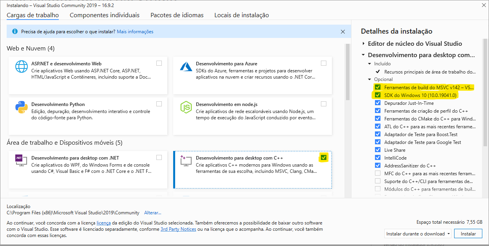

# English Version
---

## Preparing to contribute with the Querido Diário’s scrapers

The [Querido Diário’s scrapers][raspQD] are made on [Python 3] with [Scrapy] lib and it’s hosted on [GitHub]. This guide assume that you’re starting your contact with Python e you are already have Python 3 installed, hence we’re going to introduce you what you need to prepare yourself for the sprint: GitHub, git, dependencies set up and a guide showing you how to analyses websites with scrapers.
##### <ins>
Step by step on Windows
</ins>

1. The contribution platform is GitHub, so let’s [create an account][account].

2. Access the [Querido Diário’s scrapers official repository][repQD]

3. Create your fork from the project. [Here][tutoGitHub] there is a contribution tutorial on GitHub (Read until step 01 “How to open a Pull Request?”).

4. Let’s download and install [VSCode] on your computer (you can follow the pattern installation).
    - The VSCode isn’t mandatory, any text editor works, but to simplify, during the sprint we’ll assume that you’re using the terminal with PowerShell on VSCode.

5. After installing VSCode, let’s install the [git]. It’s important to check these 2 options:

6. Open VSCode and open the folder where you want the project folder be located.

7. Now, we must open the terminal:

8. Let’s clone your fork with an opened terminal. [This git tutorial][tutoGit] show how to do it (Read until the step “It’s possible copy more than one repository to my local repository?”)

9. Now you’ll need to install the [Microsoft Visual Build Tools]:

    - When you open it, you have to choose the option “Development for desktop C++” and check if there are some additional contents checked as Windows 10 SDK and the build tools from MSVC v142.

    

    - When you’ve already checked everything, carry on and wait to download the necessary files. After downloading the Visual Studio, it’s time to prepare the virtual environment to start.

10. To create a virtual environment with project dependencies, go to project’s directory (That one which was created while cloning the fork) and type this commands:

    - `1. python -m venv .venv` (create the virtual environment *.venv*)
    - `venv\Scripts\activate.ps1` (Activate the environment)
    - `pip install -r .\data_collection\requirements.txt` (Install the packages)
    - `pip list` (Check the packages that are installed on the envitonment)
    - `pre-commit install` (It’s necessary to guarantee that your contribution will follow some project patterns).
    - <ins>PS</ins>: When your virtual environment is activated and you want to disable it, type the command `deactivate`

11. That’s all folks! Everything is ready now and we do encourage you to finish the GitHub and git tutorials to familiarize and you can watch this [lecture about how to analyze websites from Querido Diário’s scraper][lecture].
See you on sprint! 🤓
---
# Versão em Português
---

## Preparação para contribuir com os raspadores do Querido Diário

Os [raspadores do Querido Diário][raspQD] são feitos no [Python 3] utilizando a biblioteca [Scrapy] e o repositório é hospedado no [GitHub]. Este guia assume que você está iniciando seu contato com Python e já tem o Python 3 instalado e vamos apresentar o necessário para se preparar para uma sprint: GitHub, git, instalação de dependências e guia de como analisar sites para raspagem.

##### <ins>
Passo-a-passo Windows
<ins>

1. A plataforma de contribuição é o GitHub, então vamos [criar uma conta][account].

2. Acesse o [repositório oficial dos raspadores do querido diário][repQD].

3. Crie o seu fork do projeto. [Aqui][tutoGitHub] tem um tutorial de contribuição no GitHub (leia até o passo 01 de “Como faço pra abrir um pull request, então?”).

4. Vamos baixar e instalar o [VSCode] na sua máquina (pode seguir a instalação padrão).
    - O VSCode não é obrigatório, qualquer editor de texto funciona, mas para simplificar, durante a sprint iremos assumir que você estará usando o terminal com Powershell pelo VSCode;

5. Após o VSCode, vamos instalar o [git]. É importante marcar essas 2 opções.

6. Abra o VSCode e abra a pasta em que você quer que a pasta do projeto fique localizada:

7. Agora devemos abrir o terminal:

8. Com o terminal aberto, vamos clonar o seu fork. [Este tutorial de git][tutoGit] mostra como (leia até o passo “É possível copiar mais de um repositório para meu repositório local?”).

9. Agora você irá precisar instalar o [Microsoft Visual Build Tools]:

    - Quando abrir o instalador, você tem que escolher a opção Desenvolvimento para desktop C++, e checar se alguns conteúdos adicionais estão marcados: SDK do Windows 10 e Ferramentas de build do MSVC v142

    

    - Quando concluir a checagem, continue com a instalação e espere baixar os arquivos necessários. Depois que baixar o Visual Studio, é hora de preparar o ambiente virtual para iniciarmos.

10. Para criar um ambiente virtual com as dependências do projeto, navegue até a pasta do projeto (a que foi criada ao clonar o fork), e use os comandos:

    - `python -m venv .venv` (criar o ambiente virtual *.venv*)
    - `.venv\Scripts\activate.ps1` (para ativar o ambiente)
    - `pip install -r .\data_collection\requirements.txt` (para instalar os pacotes)
    - `pip list` (para ver os pacotes que estão instalados no ambiente)
    - `pre-commit install` (necessário para garantir que a sua contribuição siga alguns padrões do projeto)
    - <ins>OBS</ins>: quando estiver com o ambiente virtual ativado e quiser desativá-lo, use o comando `deactivate`.

Pronto, agora que está tudo configurado, encorajamos você a terminar os tutoriais de GitHub e git para ir se familiarizando e a assistir a essa [palestra sobre como analisar sites para raspagem do Querido Diário][lecture]
Nos vemos na sprint! 🤓

[//]: # (Links:)

[raspQD]: https://github.com/okfn-brasil/querido-diario
[Python 3]: https://www.python.org/
[Scrapy]: https://scrapy.org/
[GitHub]: https://github.com/
[account]: https://github.com/join
[repQD]: https://github.com/okfn-brasil/querido-diario
[tutoGitHub]: https://www.notion.so/Github-ca9ff9fa929c47028e3955243741ec67
[VSCode]: https://code.visualstudio.com/Download
[git]: https://git-scm.com/downloads
[tutoGit]: https://www.notion.so/Git-2d4ea2e7614545169b47ff57e69a69da
[Microsoft Visual Build Tools]: https://visualstudio.microsoft.com/pt-br/downloads/
[lecture]: https://www.youtube.com/watch?v=fnGw9-xYq6I&t=16000s
